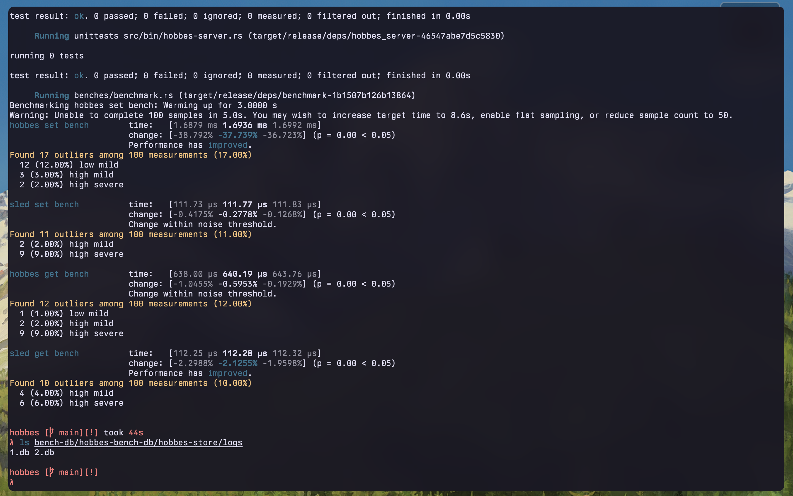

# Hobbes

A [Bitcask](https://github.com/basho/bitcask/blob/develop/doc/bitcask-intro.pdf)-like
log-structured key-value store with an in-memory index, written in Rust

Link to the [blog](https://sudhir.live/posts/hobbes-log/)

## Usage

- Clone and install the project

```sh
git clone https://github.com/anirudhsudhir/hobbes.git
cargo install --path .
```

- Start the server

```txt
./hobbes-server -h
Usage: hobbes-server [OPTIONS]

Options:
      --addr <addr>      set the server endpoint [default: 127.0.0.1:4000]
      --engine <engine>  set the storage engine [default: bitcask] [possible values: bitcask, sled]
  -h, --help             Print help
  -V, --version          Print version
```

- Use the client to issue commands to the server

```txt
./hobbes -h
A Bitcask-like log structured key-value store written in Rust

Usage: hobbes [OPTIONS] <COMMAND>

Commands:
  get   return the value associated with a key
  set   store a key-value pair
  rm    delete a key-value pair from the store
  help  Print this message or the help of the given subcommand(s)

Options:
      --addr <addr>  set the endpoint to connect to [default: 127.0.0.1:4000]
  -h, --help         Print help
  -V, --version      Print version

hobbes set foo bar
hobbes get foo
hobbes rm foo
```

- Set the logging level via environment variables

```txt
LOG_LEVEL=TRACE

Available levels
  - TRACE
  - DEBUG
  - INFO
  - WARN
  - ERROR

The default logging level is INFO
```

## Features

- Single mutable and multiple immutable logs: The store uses the Bitcask architecture. At any instance, the storage directory contains a mutable write-ahead log as well as several immutable logs
- Log Compaction: The store compacts logs when the filesize hits a certain threshold for efficient disk utilisation

## Storage engines

Hobbes offers pluggable storage backends. Currently, there are two choices:

- bitcask: The default engine with a Bitcask architecture, built from scratch
- sled: An alternate production engine with features such as ACID transactions ([Github](https://github.com/spacejam/sled))

## Client-server architecture

The key-value store is a server that listens for commands on the specified address. You may use a tool such as netcat instead of the hobbes client to send commands

```sh
echo "<length_of_cmd>\r\nSET\r\n<key>\r\n<val>\r\n" | nc <addr> <port>
echo "10\r\nGET\r\nfoo\r\n" | nc localhost 4000
echo "15\r\nSET\r\nfoo\r\nbar\r\n" | nc localhost 4000
echo "9\r\nRM\r\nfoo\r\n" | nc localhost 4000
```

The length of the command is prepended before being sent. For instance, `GET\r\nfoo\r\n` is 10 bytes long. `10\r\n` is prefixed to the command and sent.

The command and arguments are separated and terminated by a carriage return line feed (CRLF)(`\r\n`).

## Benchmarks

A benchmark of the bitcask and sled storage engines with 500 keys of variable sizes and a compaction threshold of 1 mb (the compaction is triggered when the log size exceeds 1 mb).


